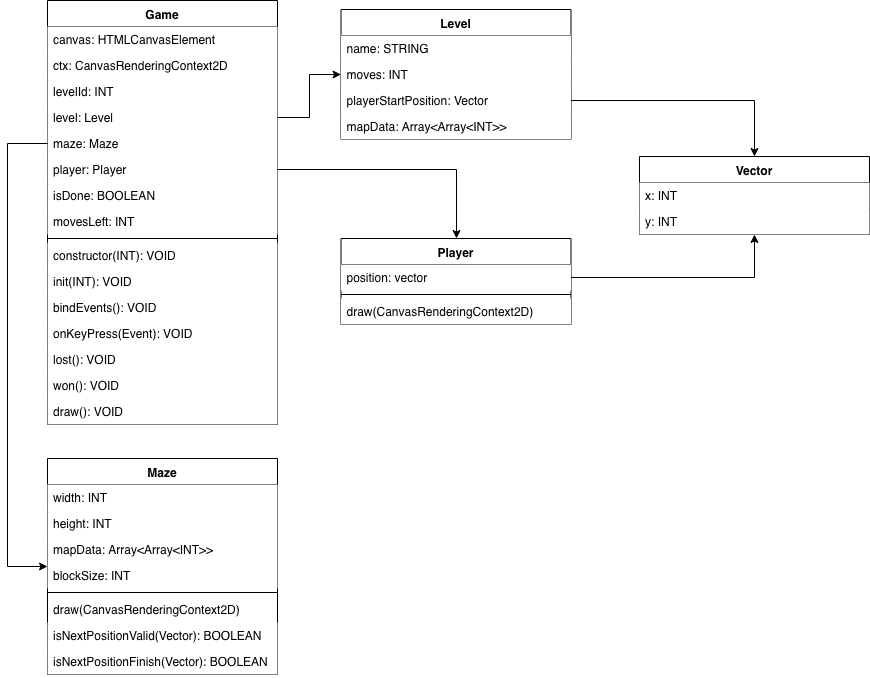

# Assignments

## Maze

### Setup
1. Go to the folder `./assignments/1_maze/`
2. Run `npm run start:dev`
3. Open `http://localhost:8080` in the browser

### Todo
Create a small game where a player has to go through a maze.

**Requirements**
- The maze is awlays a square. And consists of N amount of squares.
- Each square has one of three type (0: Empty / 1: Obstacle / 2: Finish).
- The player cannot be on the same square as an obstacle.
- The player can only move a limited amount of time. 
- The player can move up/down/left/right but only within the canvas frame.
- If the player is on the finish square the round is finished.

The following class diagram serves as an outline on how the game could be implemented. 

